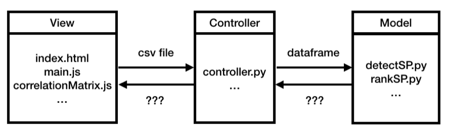

App Outline
-------------
We use Model-View-Controller (MVC) as our system architecture. Flask is used as backend server for operating the data and D3 graphs is running on the front end.

View
##########
In the view, the user uploads data file and our application sends data to backend server. 
User can uploads csv files from any local directory to our application.
D3 graphs on the front end are generated in different js files.
The JSON result from the controller is parsed to the js variable and the result will be shown in the D3 graphs.

Controller
###########
The controller reads the user uploading file as a dataframe and passes the data to the model.
After the model returns the result, controller pass the result data to the view through the JSON format.

Model
###########
Model stores the algorithms for all operations performed on the data. 
The algorithms in model return a data frame of the result to the controller. 

- Detecting SP
- Ranking SP

