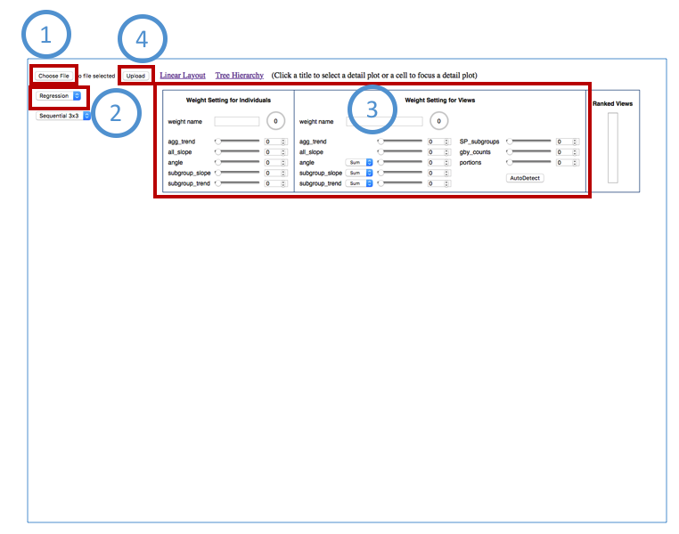

User Manual for Interactive Visualization
==========================================

Upload File
##########
  1 Click “Choose File”: select a data file from your local disk.
  
  2 Select type: regression/rate.
  
  3 Adjust weights: set weights for individual records and views. You should set the weights to 100% totally and name the setting.
  
  4 Click “Upload”: upload the data file to the web application.
  

Data Analysis
##########

Auto Detect
##########

Interactive with Scatterplot
##########

Interactive with Table
##########
