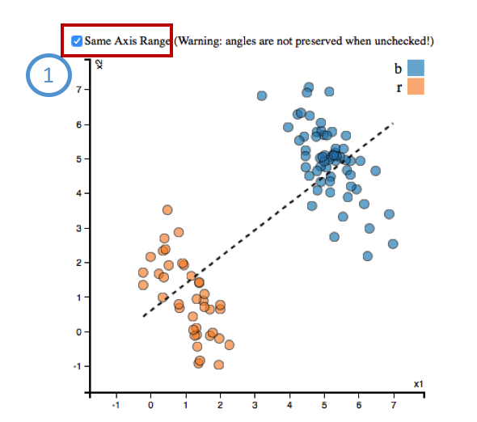

User Manual for Interactive Visualization
==========================================

Upload File
##########
  1 Click “Choose File”: select a data file from your local disk.
  
  2 Select type: regression/rate.
  
  3 Adjust weights: set weights for individual records and views. You should set the weights to 100% totally and name the setting.
  
  4 Click “Upload”: upload the data file to the web application.
  
.. image:: uploadfile.png  

Data Analysis
##########
  1 Click “Linear Layout”: bivariate matrix heatmaps will shown.
  
  2 Select bivariate color scheme for bivariate matrix heatmaps.
  
  3 Click a cell of the bivariate color legend to filter the unmatched colored cells in A. Double Click release the filtering.
  
  4 Click a cell of Bivariate matrix heatmaps to show the detail in B and C.

.. image:: dataanalysis.png  

Auto Detect
##########
  1 Adjust the threshold of correlation.

  2 Select SP-related weights
  
  3 Click “AutoDetect”: detect the SP automatically and rank the views.
  
  4 Click a view in ranked views box to filter irrelevant components in A and B.

.. image:: autodetect.png  

Ranking
##########
  1 Regression-based
    *agg_trend:

    *all_slope:
  
    *angle:
  
    *subgroup_slope:
  
    *subgroup_trend:
  
    *SP_sbugroups:
  
    *gby_counts:
  
    *portions:

.. image:: regressionrank.png  

Interact with Scatterplot
##########
  1 Click “Same Axis Range”: use the same range for both axes. Otherwise, axes’ ranges use each corresponding attributes’ data range.

Interact with Table
##########
  1 Click the header to sort the table.
  
  2 Click a row to highlight the corresponding information in A and C.

.. image:: interacttable.png  
